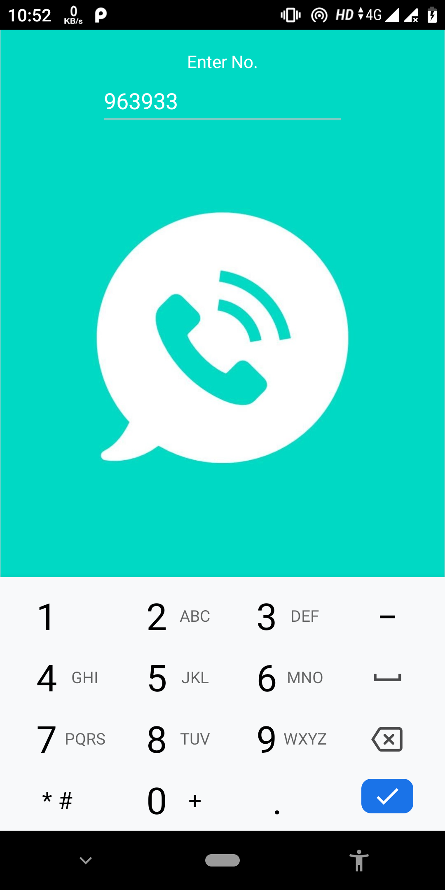

#  Calling app

## Features

* OnClickListener
* EditText
* Button
* Calling Permission
## Platform
        -> Android Studio
        -> With JAVA

## Accessing tips :

1. Clone or download the repository: `https://github.com/vishalvs9728/MessagingAPP`
2. Navigate to the folder `app` Folder
3. Navigate to the folder `Call_Activity/app/src/` to access developers content
3. Navigate to the folder `APK` for users to access apk
4. Copy the apk from folder `APK` to an android phone
5. Install the apk

The app is finally installed on your Android mobile device !!

To directly download the apk [Click Here]( https://github.com/vishalvs9728/MessagingAPP/blob/master/APK/MessageMe.apk)

 # Screenshots:

  

 
 

## Resources, Activities and Manifest for the Application

For Java File [Click here]( https://github.com/vishalvs9728/Call_Activity/blob/master/app/src/main/java/com/example/admin/call_activity/MainActivity.java)

Resource files are stored in `res` package

* [res](https://github.com/vishalvs9728/Call_Activity/tree/master/app/src/main/res)

Android manifest file for the project:

* [AndroidManifest.xml](https://github.com/vishalvs9728/Call_Activity/blob/master/app/src/main/AndroidManifest.xml)
